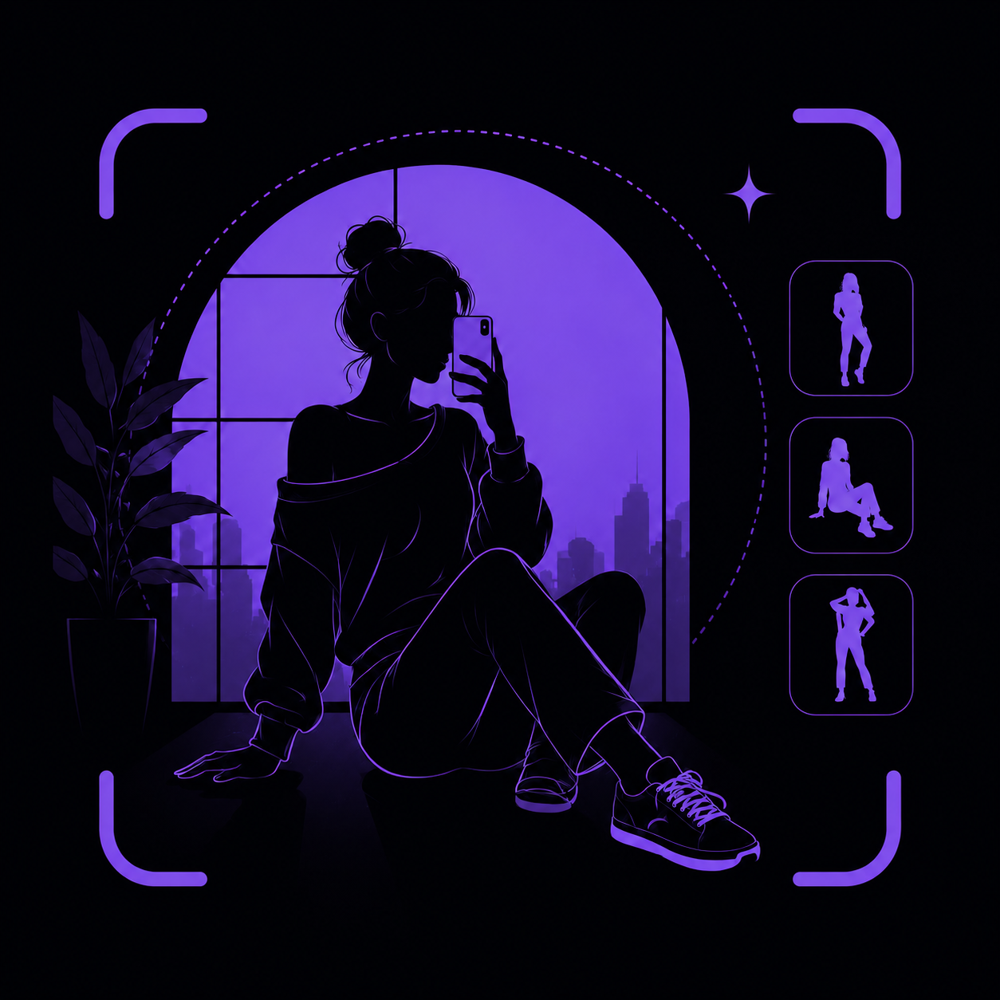

<div align="center">



# Pose Muse

**your AI photography pose assistant.**


*from a library selfie struggle to a full AI app built solo, from idea to deployment.*

</div>

---

## what is this?

people freeze when someone says *"okay, pose!"*  pose muse fixes that.

point your camera, let the app detect your environment and body framing, and get pose suggestions that actually make sense for the moment. browse hundreds of curated poses, save your favourites, organise them into albums, and use the camera tab for real-time guidance while you shoot.

no more awkward pauses. no more running out of ideas.

---

## features

```
  AI scene detection      →   detects full-body vs selfie framing on-device
  pose catalog            →   hundreds of curated poses, filterable by difficulty  
  real-time guidance      →   live camera tab with pose overlay
  save & organise         →   albums, favourites, personal collection
  dark & light theme      →   system / light / dark — saved to your account
  secure auth             →   email login, profile photo, password change
  fully offline-first     →   no internet needed for core features
```

---

## tech stack

| layer | tech |
|---|---|
| framework | Flutter (Dart) `^3.8.1` |
| AI / vision | Google ML Kit — on-device, no cloud |
| auth & database | Firebase Auth + Firestore |
| local storage | SharedPreferences + path_provider |
| camera | camera `^0.10.5+9` |
| image picking | image_picker `^1.1.2` |
| sharing | share_plus `^10.1.2` |
| font | DancingScript (variable) |

> all AI inference runs entirely on-device — no API calls, no data sent anywhere.

---

## getting started

### prerequisites
- Flutter SDK `^3.8.1`
- Firebase project (Auth + Firestore enabled)
- Android Studio / VS Code

### setup

```bash
# clone the repo
git clone https://github.com/Abhizz-b/Pose_Muse.git
cd Pose_Muse

# install dependencies
flutter pub get
```

### missing files (create these yourself)

some files are excluded from this repo for security. you'll need to create them:

**`lib/firebase_options.dart`**
```bash
# install flutterfire cli and run:
flutterfire configure
```

**`android/app/google-services.json`**
download from your Firebase console → Project Settings → Android app.

**`lib/services/background_removal_service.dart`**
uses the [remove.bg API](https://www.remove.bg/api). create the file with your own API key:
```dart
class BackgroundRemovalService {
  static const String _apiKey = 'YOUR_REMOVE_BG_API_KEY';
  // ... rest of implementation
}
```

**`lib/services/detection_service.dart`**
uses Google ML Kit for on-device pose detection. build your own or use the ML Kit docs as reference.

```bash
# once all files are in place
flutter run
```

---

## project structure

```
lib/
├── models/          # data models
├── screens/         # all app screens
│   ├── home_screen.dart
│   ├── catalog_screen.dart
│   ├── gallery_screen.dart
│   ├── settings_screen.dart
│   ├── privacy_policy_screen.dart
│   └── about_posemuse_screen.dart
├── services/        # business logic & APIs
├── widgets/         # reusable components
├── main.dart
└── splash_screen.dart
```

---

## the story

I'm Abhipsa a final year B.Tech student. I was sitting in my college library trying to click selfies and completely ran out of poses. That tiny frustration became this app.

Everything you see here idea, design, code, deployment built alone. This is my first app. The poses in the catalog? That's me. Had to avoid copyright somehow.

---

## contributing

feel free to fork this repo and build on top of it. if you do, a ⭐ would mean a lot.

> note: some service files are excluded for security. see [missing files](#missing-files-create-these-yourself) above to set up your own.

---

## license

this project is open source and available under the [MIT License](LICENSE).

---

<div align="center">

made with love, one pose at a time. 🖤

**[Abhipsa Bose](https://github.com/Abhizz-b)**

</div>
